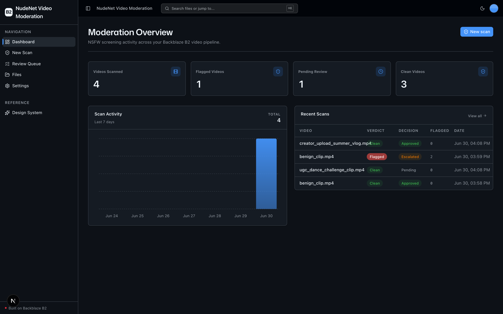
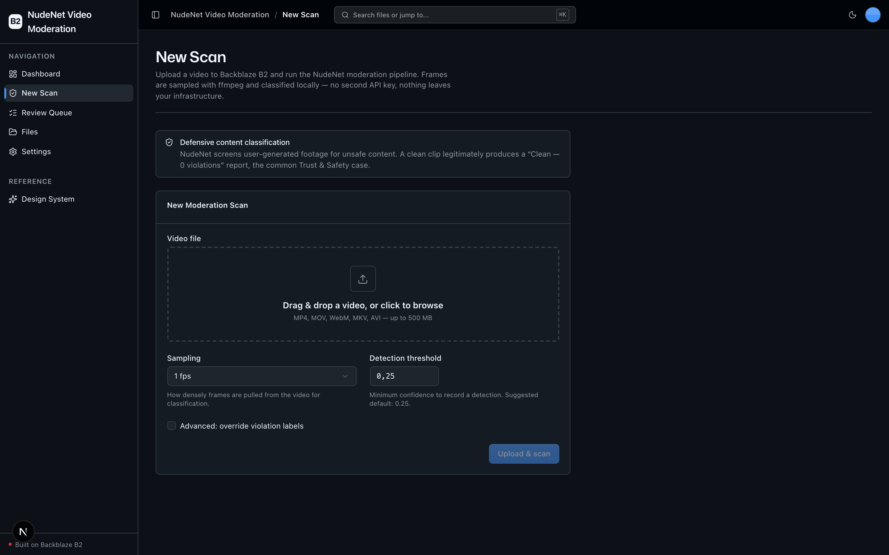
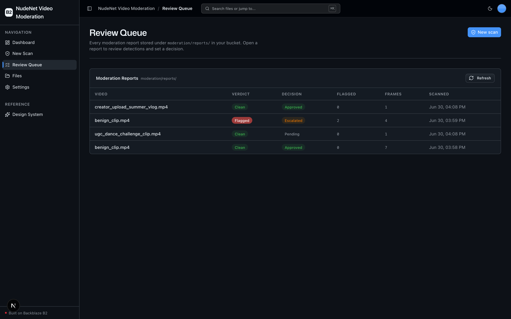
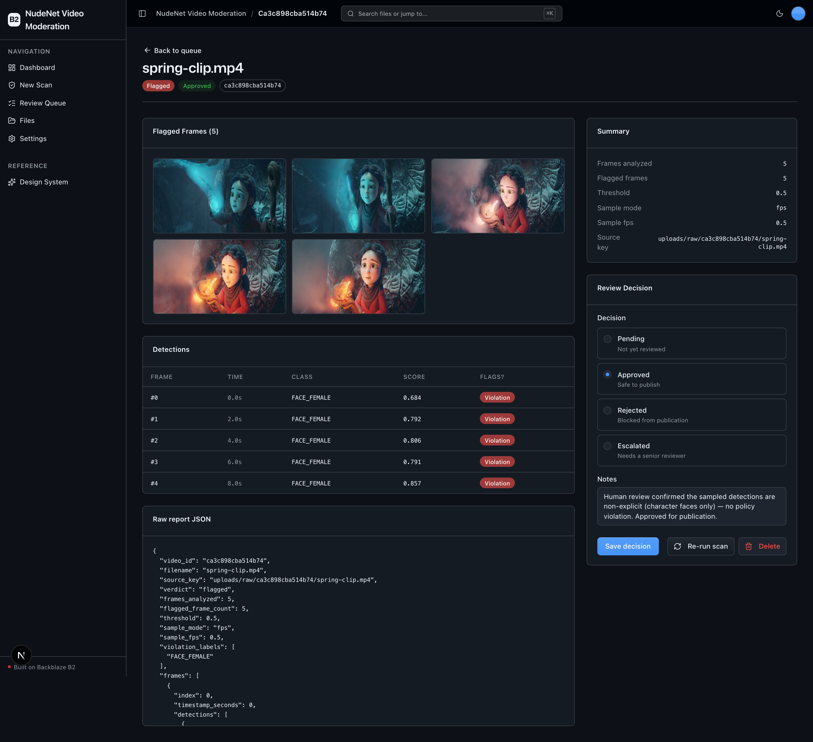

<!-- last_verified: 2026-06-30 -->
# NudeNet Video Moderation

Self-hosted, open-source **Trust & Safety pipeline** that screens user-generated
video for NSFW / unsafe content before publication — with every artifact stored
on **[Backblaze B2](https://www.backblaze.com/cloud-storage?utm_source=github&utm_medium=referral&utm_campaign=ai_artifacts&utm_content=nudenet-video-moderation)**.

A T&S operator ingests a raw video, the pipeline samples frames with ffmpeg,
classifies each frame **locally** with [NudeNet](https://github.com/notAI-tech/NudeNet)
(an ONNX detector — no external API, no second key), writes flagged-frame crops
and a per-video moderation report JSON back to B2, and appends the result to an
aggregated violations manifest. The web app is the reviewer's console: a
moderation dashboard, a review queue of per-video reports, a per-video report
detail with the per-frame detection table + flagged-frame grid, and a
human-in-the-loop decision (approve / reject / escalate).

## What it looks like

**Dashboard** — moderation metrics (videos scanned, flagged, pending, clean), a 7-day scan-activity chart, and a recent-scans table.



**New Scan** — upload a video to B2 and run the pipeline, with sampling, detection-threshold, and violation-label controls.



**Review Queue** — every moderation report stored under `moderation/reports/`, with verdict, human decision, flagged-frame count, and scan time.



**Report detail** — flagged-frame grid, the per-frame detection table, a run summary, and the human-in-the-loop decision panel.



> _This example run sets the per-scan `violation_labels` override to `FACE_FEMALE` so the flagged → review → decision workflow is populated with safe footage — no NSFW media. Demo clip: [Spring](https://studio.blender.org/films/spring/) © Blender Studio, [CC BY 4.0](https://creativecommons.org/licenses/by/4.0/)._

## Why B2

High-velocity UGC ingest multiplies stored objects: every raw video plus its
sampled flagged-frame crops plus a JSON report. A platform moderating millions
of clips ends up with **millions of small objects** — exactly the
high-object-count, high-throughput profile object storage is built for. This
sample uses Backblaze B2 through the **S3-compatible API** for every operation
(upload, list, get, presign, delete), so it drops into any S3 tooling and B2
becomes the durable storage layer for the entire moderation workflow.

## Safety note (governs the build and the demo)

NudeNet is a **defensive** content classifier. This pipeline never needs,
bundles, downloads, or generates NSFW media. The quickstart and the automated
end-to-end verification use a **synthetic benign clip** generated by the bundled
ffmpeg (`testsrc` / solid-color frames). A clean clip legitimately produces a
**"Clean — 0 violations"** report, which is the common Trust & Safety case and
is fully presentable. NudeNet also detects non-explicit classes (FACE, FEET,
BELLY) that fire on ordinary clothed footage — so a benign clip can still
populate the detection table while the flagged grid stays empty, demonstrating
the detect-but-don't-flag policy without any unsafe content.

## Architecture

```
apps/web/          Next.js 16 frontend (App Router, Tailwind v4, shadcn/ui)
services/api/      FastAPI backend (layered: types/config/repo/service/runtime)
packages/shared/   Shared TypeScript types
docs/              Feature docs, workflows, security, reliability
infra/railway/     Deployment config
```

The moderation pipeline lives entirely in `services/api/app/service/`:

- `frames.py` — frame sampling via the **imageio-ffmpeg bundled static binary**
  (`fps` mode or `keyframes` mode). Works from a fresh clone, no system ffmpeg.
- `classifier.py` — lazy, process-wide NudeNet `NudeDetector` singleton.
- `moderation.py` + `moderation_store.py` — pipeline orchestration and the B2
  read/write layer (reports + manifest).

See [ARCHITECTURE.md](ARCHITECTURE.md) and [docs/features/](docs/features/).

## Features

| Feature | Deployment | Cost |
|---|---|---|
| Video ingest to B2 | local (B2 only) | $0 (B2 storage) |
| Frame sampling (ffmpeg) | local | $0 |
| NSFW classification (NudeNet, ONNX) | local | $0 |
| Flagged-frame extracts + report JSON | local | $0 |
| Review queue + human decision | local | $0 |
| Aggregated violations manifest | local | $0 |

**Runs on local OSS — no second API key.** Only Backblaze B2 credentials are
required. NudeNet runs on `onnxruntime` (not torch); CPU is the shipped default
execution provider. A GPU is optional: swap `onnxruntime` for `onnxruntime-gpu`
to enable the CUDA execution provider. (onnxruntime has no first-class Apple MPS
provider, so on Apple silicon the local fallback chain is CUDA → CPU.)

## Object layout in B2

```
uploads/raw/<video_id>/<file>            raw ingested video
moderation/flagged/<video_id>/frames/    flagged frame JPEGs
moderation/reports/<video_id>.json       per-video moderation report
moderation/manifest.jsonl                aggregated index (dashboard + queue)
```

The manifest is maintained read-modify-write (S3 has no append): read the
current object, append the new entry line, `put_object` it back. This is an
honest object-storage teaching point — not concurrency-safe under parallel jobs,
which is fine for the sample and noted as a production caveat.

## Quickstart

### Prerequisites

- Node 20+, pnpm 9+, Python 3.11+
- A Backblaze B2 bucket and an application key
  ([create one](https://secure.backblaze.com/app_keys.htm?utm_source=github&utm_medium=referral&utm_campaign=ai_artifacts&utm_content=nudenet-video-moderation))

### 1. Configure B2

```bash
cp .env.example .env
# edit .env with your B2 credentials
```

The S3 endpoint is **derived from `B2_REGION`** as
`https://s3.<B2_REGION>.backblazeb2.com`, and the region is passed to the boto3
client for correct S3v4 signing.

| Variable | Description |
|----------|-------------|
| `B2_APPLICATION_KEY_ID` | Your B2 application key ID |
| `B2_APPLICATION_KEY` | Your B2 application key |
| `B2_BUCKET_NAME` | Target bucket |
| `B2_REGION` | Bucket region, e.g. `us-west-004` |
| `B2_PUBLIC_URL_BASE` | Optional public/CDN base URL (blank → presigned URLs) |

### 2. Install dependencies

```bash
pnpm install
cd services/api && python3 -m venv .venv && source .venv/bin/activate \
  && pip install -r requirements.txt && cd ../..
```

### 3. Run

```bash
pnpm dev          # web on :3000, api on :8000
```

Open <http://localhost:3000>, click **New Scan**, and upload a video. To make a
safe test clip with the bundled ffmpeg:

```bash
services/api/.venv/bin/python - <<'PY'
import imageio_ffmpeg, subprocess
subprocess.run([imageio_ffmpeg.get_ffmpeg_exe(), "-f", "lavfi",
  "-i", "testsrc=duration=5:size=640x480:rate=10",
  "-pix_fmt", "yuv420p", "benign.mp4"], check=True)
print("wrote benign.mp4")
PY
```

The scan produces a clean report you can review in the queue.

## Commands

```bash
pnpm dev               # frontend + backend
pnpm lint              # eslint
pnpm build             # next type check + build
pnpm typecheck         # tsc --noEmit
pnpm lint:api          # ruff
pnpm test:api          # pytest (offline — no model load)
pnpm check:structure   # layering boundary tests
```

The unit suite is **offline**: heavy ML imports are lazy, so `pnpm test:api`
runs without loading the model. The real model-load + ffmpeg path is covered by
an end-to-end run on a synthetic benign clip.

## B2 standards

- **S3-compatible API only** — no b2-native calls.
- **Custom user agent** `b2-nudenet-video-moderation` on the single boto3 client.
- **Standard env var names**: `B2_APPLICATION_KEY_ID`, `B2_APPLICATION_KEY`,
  `B2_BUCKET_NAME`, `B2_REGION`, `B2_PUBLIC_URL_BASE`.

Built on [Backblaze B2](https://www.backblaze.com/cloud-storage?utm_source=github&utm_medium=referral&utm_campaign=ai_artifacts&utm_content=nudenet-video-moderation).
